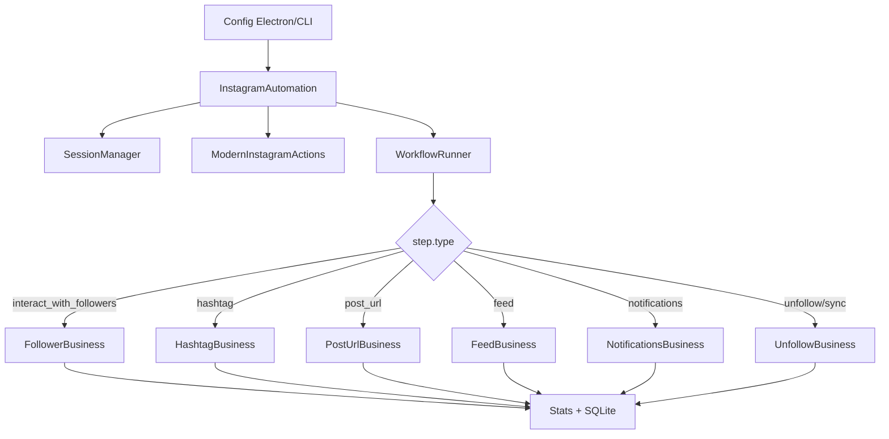
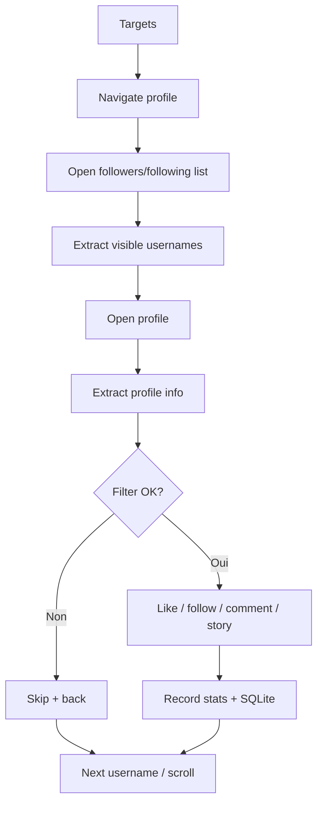

# Workflows Instagram

Cette page decrit les workflows Instagram du point de vue produit : ce qu'ils font, quelles entrees ils attendent et comment ils s'enchainent.

Pour la documentation technique du package Python `bot/taktik/core/social_media/instagram/workflows/`, voir aussi [Workflows haut niveau](../modules/instagram/workflows.md).

## Deux couches de workflows

Le module Instagram utilise deux niveaux d'orchestration.

| Couche | Emplacement | Usage |
|---|---|---|
| Workflows d'interaction | `actions/business/workflows/` | Logique metier reutilisable : followers, hashtag, post URL, feed, notifications, unfollow, messaging |
| Workflows applicatifs | `workflows/` | Orchestration bridge/CLI : session globale, runner de steps, scraping, publication, DM outreach |

En pratique, `InstagramAutomation` lit une config de session, `WorkflowRunner` dispatch chaque step, puis les actions business executent les interactions UI.

## Tableau recapitulatif

| Workflow | Classe principale | Cible | Effet |
|---|---|---|---|
| Followers / Following | `FollowerBusiness` | Liste followers/following d'un target | Like, follow, comment, story selon probabilites |
| Hashtag | `HashtagBusiness` | Likers de posts d'un hashtag | Interactions sur profils qualifies |
| Post URL | `PostUrlBusiness` | Likers d'un post precis | Interactions sur profils qualifies |
| Feed | `FeedBusiness` | Feed du compte connecte | Interactions avec auteurs et/ou likers |
| Notifications | `NotificationsBusiness` | Profils dans les notifications | Interactions depuis l'activite Instagram |
| Unfollow | `UnfollowBusiness` | Following list du compte connecte | Sync, detection non-followers, unfollow protege |
| Sync following | `UnfollowBusiness` | Following + non-followers | Sync SQLite + IPC `sync_complete` |
| Sync followers/following | `UnfollowBusiness` | Following puis followers | Sync complet + IPC `sync_step` |
| Scraping | `ScrapingWorkflow` | Targets, hashtags ou post URL | Extraction de profils sans interaction |
| Post scraping | `PostScrapingWorkflow` | Un post precis | Stats, likers, commentaires, profils enrichis |
| DM Outreach | `DMOutreachWorkflow` | Liste de recipients | DM personnalises, variants, follow optionnel |
| DM Auto Reply | `DMAutoReplyWorkflow` | Inbox Instagram | Reponse automatique via OpenRouter |
| Smart Comment | `SmartCommentBridge` | Commentaires d'un post cible | Scrape, qualification IA, generation de reponses, envoi optionnel |
| Content | `ContentWorkflow` | Media local | Publication post, story ou reel |
| Cold DM legacy | `ColdDMWorkflow` | Liste de recipients | Ancien envoi de DM standalone |

## Execution par steps

Les sessions interactives passent par `InstagramAutomation.run_workflow()`.



Types de steps supportes par `WorkflowRunner` :

| `type` | Description |
|---|---|
| `initialize` | Step neutre de demarrage |
| `interact_with_followers` | Interaction avec followers/following de targets |
| `hashtag` | Interaction avec likers de posts d'un hashtag |
| `post_url` | Interaction avec likers d'un post specifique |
| `place` | Interaction via recherche de lieu |
| `notifications` | Interaction depuis les notifications |
| `unfollow` | Sync following + scrape non-followers + unfollow |
| `sync_following` | Sync following et categorie non-followers, puis IPC |
| `sync_followers_following` | Sync following puis followers, puis IPC |
| `scrape_non_followers` | Scrape autonome des non-followers |
| `feed` | Interaction dans le feed |

## Configuration commune

Les steps interactifs partagent trois familles de parametres.

### Probabilites

```json
{
  "probabilities": {
    "like_percentage": 70,
    "follow_percentage": 15,
    "comment_percentage": 5,
    "story_percentage": 10
  }
}
```

`WorkflowConfigBuilder` convertit ces pourcentages en probabilites `0.0-1.0` attendues par la couche business.

### Filtres

```json
{
  "min_followers": 100,
  "max_followers": 20000,
  "min_posts": 3,
  "max_following": 10000,
  "allow_private": false,
  "max_followers_following_ratio": 10.0
}
```

Ces champs deviennent `filter_criteria` et sont ensuite traites par `FilteringBusiness`.

### Limites de session

```json
{
  "session_settings": {
    "session_duration_minutes": 60,
    "total_profiles_limit": 100,
    "total_likes_limit": 80,
    "total_follows_limit": 20,
    "delay_between_actions": { "min": 5, "max": 15 }
  }
}
```

`SessionManager.should_continue()` arrete la session quand une limite locale est atteinte. Le systeme actif ne consomme plus de quota distant action par action ; les compteurs restent locaux a la session et a SQLite.

## Followers / Following

Le workflow followers visite un ou plusieurs comptes cibles, ouvre leur liste followers/following, extrait les profils visibles, filtre, puis interagit.

```json
{
  "type": "interact_with_followers",
  "target_usernames": ["influencer1", "influencer2"],
  "interaction_type": "followers",
  "max_interactions": 50,
  "max_likes_per_profile": 2,
  "probabilities": {
    "like_percentage": 70,
    "follow_percentage": 20,
    "comment_percentage": 5,
    "story_percentage": 10
  }
}
```

Flux simplifie :



## Hashtag

Le workflow hashtag cherche un hashtag, ouvre des posts, puis interagit avec les likers selon les filtres et probabilites.

```json
{
  "type": "hashtag",
  "hashtags": ["fitness", "running"],
  "max_interactions": 40,
  "max_likes_per_profile": 2,
  "post_criteria": {
    "min_likes": 100,
    "max_likes": 50000
  }
}
```

Le runner traite actuellement le premier hashtag de la liste pour le step courant. Les campagnes multi-hashtags peuvent fournir plusieurs steps.

## Post URL

Le workflow post URL cible directement un post Instagram et travaille sur ses likers.

```json
{
  "type": "post_url",
  "post_url": "https://www.instagram.com/p/ABC123/",
  "max_interactions": 30,
  "probabilities": {
    "like_percentage": 70,
    "follow_percentage": 15
  }
}
```

Il utilise `PostUrlBusiness.interact_with_post_likers()` et remonte les stats `likes_made`, `follows_made`, `comments_made`, `users_interacted`.

## Feed

Le workflow feed parcourt le feed du compte connecte.

```json
{
  "type": "feed",
  "max_interactions": 20,
  "max_posts_to_check": 30,
  "interact_with_post_author": true,
  "interact_with_post_likers": false,
  "skip_reels": true,
  "skip_ads": true,
  "min_post_likes": 0,
  "max_post_likes": 0
}
```

Il peut interagir avec l'auteur du post et, si active, avec les likers du post.

## Notifications

Le workflow notifications traite les profils presents dans l'activite Instagram.

```json
{
  "type": "notifications",
  "max_interactions": 20,
  "notification_types": ["likes", "follows", "comments"],
  "like_percentage": 70,
  "follow_percentage": 15,
  "comment_percentage": 5,
  "story_watch_percentage": 10
}
```

Il est utile pour repondre aux signaux entrants : likes recents, nouveaux followers, commentaires.

## Unfollow et sync

Le workflow unfollow orchestre trois etapes :

1. `sync_following_list()` pour mettre a jour la liste following locale ;
2. `scrape_non_followers_category()` pour classer non-followers et mutuals ;
3. `run_simple_unfollow_from_list()` depuis la liste following.

```json
{
  "type": "unfollow",
  "max_unfollows": 50,
  "min_delay": 2,
  "max_delay": 5,
  "skip_verified": true,
  "skip_business": false
}
```

Deux workflows one-shot existent pour l'interface :

| `type` | Effet IPC |
|---|---|
| `sync_following` | Emet `sync_complete` avec `new_count`, `updated_count`, `non_followers_count`, `mutuals_count` |
| `sync_followers_following` | Emet `sync_step` pour following/followers puis `sync_complete` |

## Scraping de profils

`ScrapingWorkflow` extrait des profils sans like, follow, commentaire ou DM.

### Target

```json
{
  "type": "target",
  "target_usernames": ["brand_a", "brand_b"],
  "scrape_type": "followers",
  "max_profiles": 500,
  "enrich_profiles": false,
  "export_csv": true,
  "save_to_db": true
}
```

`scrape_type` accepte notamment `followers`, `following` et `posts`. En mode `posts`, le workflow ouvre le premier post du target et scrape ses likers/commenters selon les options.

### Hashtag

```json
{
  "type": "hashtag",
  "hashtags": ["cinema"],
  "max_profiles": 300,
  "scrape_likers": true,
  "scrape_commenters": false,
  "enrich_profiles": true
}
```

### Post URL

```json
{
  "type": "post_url",
  "post_urls": ["https://www.instagram.com/p/ABC123/"],
  "scrape_likers": true,
  "scrape_commenters": true,
  "max_profiles": 200
}
```

Le moteur de liste utilise `ListScrapingStrategy` pour unifier followers, likers et commenters : extraction visible, clic profil, enrichissement, dedup, scroll, retour a la liste.

## Post scraping

`PostScrapingWorkflow` analyse un post precis plus en profondeur que le scraping generique.

```json
{
  "post_url": "https://www.instagram.com/p/ABC123/",
  "scrape_likers": true,
  "scrape_comments": true,
  "max_likers": 50,
  "max_comments": 100,
  "enrich_profiles": true,
  "max_profiles_to_enrich": 30,
  "comment_sort": "most_recent"
}
```

Resultats principaux :

| Donnee | Description |
|---|---|
| `post_stats` | Auteur, likes, commentaires, shares, saves, caption |
| `likers_count` | Nombre de likers captures |
| `comments_count` | Nombre de commentaires captures |
| `enriched_profiles_count` | Nombre de profils enrichis |

## Prospection avancee

L'ancien workflow Discovery dedie a ete supprime du code. La prospection avancee
est couverte par `ScrapingWorkflow`, `PostScrapingWorkflow`, `deep_qualify.py`
et la qualification IA des profils scrapes.

Ne plus documenter ni recreer `DiscoveryWorkflowV2`, `discovery_bridge.py`,
`DiscoveryRepository`, `DiscoveryService` ou un dossier `workflows/discovery/`.

## DM

### DM Outreach

`DMOutreachWorkflow` est le workflow moderne pour l'envoi de messages directs en masse.

Il supporte les templates personnalises, les variantes A/B, le follow optionnel avant message, les delais humains et le skip des conversations existantes.

Le chemin desktop complet `ColdDM.tsx` -> `coldDm.ts` -> `cold_dm_bridge` -> `sent_dms` est documente dans [DM & Cold DM end-to-end](dm-cold-dm.md).

### DM Auto Reply

`DMAutoReplyWorkflow` lit les conversations non lues, filtre les messages, genere une reponse via OpenRouter, attend un delai humain, puis envoie la reponse.

Il expose `run_async()` et une facade synchrone `run()`.

Le chemin desktop complet `DMResponses.tsx` -> `dm.ts` -> `dm_bridge` est documente dans [DM & Cold DM end-to-end](dm-cold-dm.md).

### Cold DM legacy

`ColdDMWorkflow` reste disponible pour les anciens appels standalone, mais les nouveaux usages doivent preferer `DMOutreachWorkflow`.

## Smart Comment

`smart_comment_bridge` vit dans `bridges/instagram/engagement/smart_comment.py`, car il est appele directement par Electron comme bridge dedie.

Pipeline :

1. ouvrir un post cible, ou le premier post d'un profil ;
2. capturer le contexte du post : auteur, caption, metadonnees et description visuelle ;
3. ouvrir les commentaires et scraper la liste ;
4. qualifier les commentaires comme prospects ou non ;
5. generer des reponses contextualisees ;
6. envoyer les reponses avec delais humains, ou rester en `dryRun`.

Config principale :

```json
{
  "deviceId": "DEVICE_ID",
  "postUrl": "https://www.instagram.com/p/ABC123/",
  "mode": "scrape",
  "maxComments": 500,
  "qualificationPrompt": "Identifier les prospects pertinents",
  "replyPrompt": "Repondre naturellement et inviter a echanger",
  "replyTone": "friendly",
  "replyLanguage": "fr",
  "delayBetweenReplies": [30, 90],
  "dryRun": true
}
```

## Publication de contenu

`ContentWorkflow` publie des medias depuis le poste local vers Instagram.

| Methode | Usage |
|---|---|
| `post_single_photo()` | Photo unique avec caption, hashtags et location optionnelle |
| `post_reel()` | Reel depuis un fichier video |
| `post_story()` | Story depuis une image |
| `post_multiple_photos()` | Publication sequentielle de plusieurs photos |

Le workflow pousse le media sur le device, ouvre la creation de contenu, selectionne le type, remplit les champs, gere les popups et publie.

## Recovery et limites

| Situation | Comportement attendu |
|---|---|
| Popup inattendue | Dismiss via selectors centralises puis retry local |
| Profil introuvable | Skip et passage au profil suivant |
| Liste vide ou limitee | Scroll/retry, puis arret propre si fin detectee |
| Limite de session | Finalisation `COMPLETED` avec raison |
| Enregistrement local impossible | Action considérée en erreur et stats non fiables |
| Workflow one-shot sync | Emission IPC puis `session_finalized = True` |
| Erreur scraping/qualification | Session marquee en erreur ou stoppee avec raison explicite |
