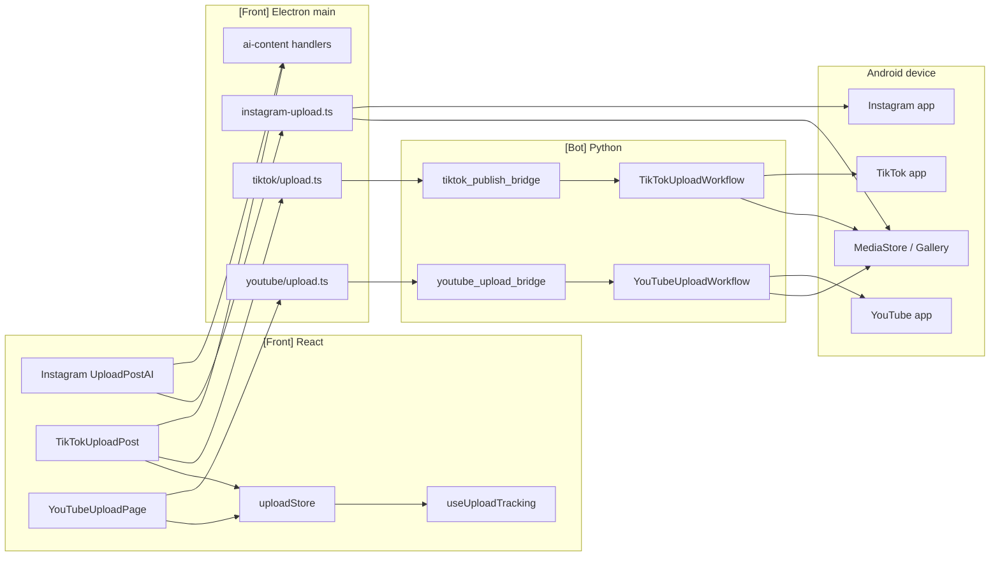
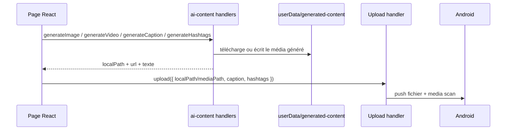
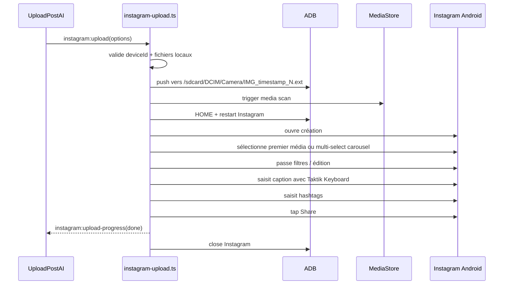
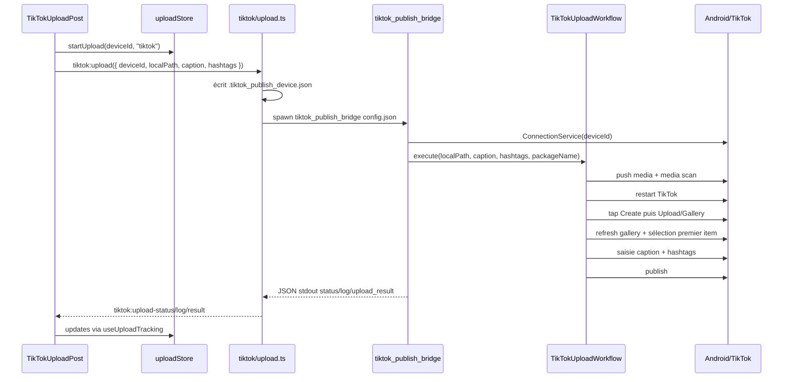
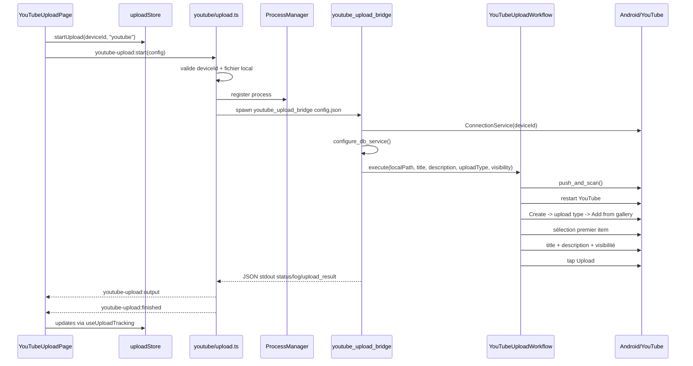

# Upload Content `[Transversal]`

Cette page documente les workflows de publication de contenu depuis l'application desktop TAKTIK vers Instagram, TikTok et YouTube.

Le point important : les trois plateformes n'utilisent pas exactement la même architecture.

| Plateforme | Chemin principal | Bridge Python | Tracking global | Particularité |
|---|---|---:|---:|---|
| Instagram | React -> Electron handler -> ADB direct -> Instagram Android | Non | Partiel | Machine d'etat TypeScript dans Electron |
| TikTok | React -> Electron handler -> `tiktok_publish_bridge` -> workflow Bot | Oui | Oui | Publication pilotee par `TikTokUploadWorkflow` |
| YouTube | React -> Electron handler -> `youtube_upload_bridge` -> workflow Bot | Oui | Oui | Publication pilotee par `YouTubeUploadWorkflow` |

## Cartographie

| Couche | Instagram | TikTok | YouTube |
|---|---|---|---|
| Page UI `[Front]` | `front/src/features/platforms/instagram/upload/post/UploadPostAI.tsx` | `front/src/features/platforms/tiktok/upload/post/TikTokUploadPost.tsx` | `front/src/features/platforms/youtube/pages/YouTubeUploadPage.tsx` |
| Preload `[Front]` | `front/electron/preload/platforms/instagram/instagram.ts` | `front/electron/preload/platforms/tiktok/tiktok.ts` | `front/electron/preload/platforms/youtube/youtube.ts` |
| Handler Electron `[Front]` | `front/electron/handlers/instagram/publish/instagram-upload.ts` | `front/electron/handlers/tiktok/upload.ts` | `front/electron/handlers/youtube/upload.ts` |
| Bridge `[Bot]` | Aucun | `bot/bridges/tiktok/publish/publish.py` (`tiktok_publish_bridge`) | `bot/bridges/youtube/publish/upload.py` (`youtube_upload_bridge`) |
| Workflow métier `[Bot]` | Aucun, logique dans Electron | `bot/taktik/core/social_media/tiktok/workflows/publish/upload_workflow.py` | `bot/taktik/core/social_media/youtube/workflows/publish/upload_workflow.py` |
| Tracking `[Front]` | Page locale, `uploadStore` partiel, events sans `deviceId` | `uploadStore` + `useUploadTracking` | `uploadStore` + `useUploadTracking` |

## Vue D'ensemble



## Contrat UI

Les pages d'upload construisent toutes un objet de publication depuis :

| Donnée | Instagram | TikTok | YouTube |
|---|---|---|---|
| Appareil | `deviceId` | `deviceId` | `deviceId` |
| Média local | `mediaPath`, `mediaPaths` | `localPath` | `localPath` |
| Type de contenu | `post`, `reel`, `carousel`, `story` | Post TikTok | `short`, `video` |
| Texte | `caption` | `caption` | `title`, `description` |
| Hashtags | `hashtags[]` | `hashtags[]` | Dans description si l'UI les ajoute plus tard |
| Clone/package | `packageName` optionnel | `packageName` optionnel | Non documenté côté UI actuel |
| Visibilité | Non | Non | `public`, `unlisted`, `private` |

Les fichiers sélectionnés par l'utilisateur viennent du navigateur Electron. Les pages conservent le chemin local via `File.path` quand Electron l'expose.

## Génération IA

La génération IA est côté `[Front] Electron`, pas dans les bridges Python d'upload.



Fonctions utilisées par Instagram `UploadPostAI.tsx` :

| Fonction | Rôle |
|---|---|
| `aiContent.enhancePrompt` | Améliore le prompt image/vidéo |
| `aiContent.generateImage` | Produit une ou plusieurs images, dont carousel |
| `aiContent.generateVideo` | Produit un média vidéo pour reels |
| `aiContent.analyzeImage` | Vision model pour décrire une image générée |
| `aiContent.generateCaption` | Génère une légende |
| `aiContent.generateHashtags` | Génère une liste de hashtags |
| `aiContent.generateCaptionAndHashtags` | Génération combinée depuis une description |

TikTok utilise surtout la génération texte via OpenRouter depuis sa page UI : caption et hashtags sont générés avant l'appel `tiktokUpload.upload()`.

## Etat reel des pages UI

| Page | Etat | Detail |
|---|---|---|
| `UploadPostAI.tsx` | Active | Page principale Instagram pour post, reel, carousel, story avec generation IA. Elle gere ses logs/progress localement. |
| `UploadPost.tsx` | Legacy non routee | Page upload manuel plus simple encore presente dans le code, mais non exposee par le routeur courant. Si elle est reutilisee localement, elle branche `uploadStore` directement car l'event Instagram ne porte pas `deviceId`. |
| `UploadReel.tsx` | Placeholder | Ecran non fonctionnel : bouton disabled, pas d'appel IPC. Le reel reel passe par `UploadPostAI.tsx` ou `UploadPost.tsx` avec `uploadType: "reel"`. |
| `TikTokUploadPost.tsx` | Active | Selection media, generation caption/hashtags possible, tracking global. |
| `YouTubeUploadPage.tsx` | Active | Upload short/video avec visibility, tracking global. |

## Instagram

Instagram est le cas le plus particulier : il ne lance pas de subprocess Python. Le handler Electron pilote directement l'app Android avec ADB.

### Entrées

```ts
interface UploadOptions {
  deviceId: string
  mediaPath: string
  mediaPaths?: string[]
  mediaType: 'image' | 'video'
  uploadType?: 'post' | 'reel' | 'carousel' | 'story'
  caption?: string
  hashtags?: string[]
  packageName?: string
}
```

Canaux IPC :

| Canal | Sens | Rôle |
|---|---|---|
| `instagram:upload` | Renderer -> Main | Lance la publication |
| `instagram:upload-stop` | Renderer -> Main | Ajoute le `deviceId` aux uploads annulés |
| `instagram:upload-progress` | Main -> Renderer | Progression `{ status, message }` |
| `instagram:format-caption` | Renderer -> Main | Formate caption + hashtags |
| `instagram:check-installed` | Renderer -> Main | Vérifie le package Instagram ou clone |
| `instagram:open` | Renderer -> Main | Ouvre Instagram ou un clone |

### Machine D'état

Le handler lit régulièrement un dump UI Android via :

| Fonction | Rôle |
|---|---|
| `getUiDump()` / `getUiDumpAsync()` | Lance `uiautomator dump`, lit le XML |
| `parseScreenState()` | Transforme le XML en état métier |
| `detectCurrentScreen()` | Version synchrone |
| `detectCurrentScreenAsync()` | Version asynchrone |
| `waitForScreen()` | Attend un état cible avec timeout |

Etats détectés :

| Etat | Signification |
|---|---|
| `permission_dialog` | Popup Android qui bloque l'écran |
| `instagram_home` | Feed Instagram |
| `instagram_profile` | Onglet profil |
| `instagram_creation_select` | Ecran galerie/sélection |
| `instagram_creation_filters` | Ecran filtres/édition |
| `instagram_creation_caption` | Ecran légende |
| `instagram_sharing` | Partage en cours |
| `instagram_shared` | Confirmation de partage |
| `other_app` | Une autre application est au premier plan |
| `unknown` | Etat non reconnu |

### Séquence Post/Reel/Carousel



### Séquence Story

Le mode story suit une route séparée :

1. Redémarrage Instagram.
2. Swipe horizontal depuis le feed vers la caméra story.
3. Tap sur le bouton galerie.
4. Sélection du média le plus récent.
5. Publication story via les boutons dédiés de l'interface story.

Cette séparation est importante : les stories ne passent pas par les mêmes écrans que les posts/reels.

### Clones Instagram

Le handler supporte les clones via `packageName`.

| Élément | Comportement |
|---|---|
| `OFFICIAL_PACKAGE` | `com.instagram.android` |
| `activePackageByDevice` | Map `deviceId -> packageName actif` |
| `rid(deviceId, value)` | Réécrit les resource-id officiels vers le package clone |
| `instagram:check-installed` | Vérifie le package fourni |
| `instagram:open` | Ouvre l'activité principale du package fourni |

### Annulation

L'annulation est locale au handler :

| Élément | Rôle |
|---|---|
| `cancelledUploads` | `Set<string>` par `deviceId` |
| `instagram:upload-stop` | Ajoute le device à l'ensemble |
| `checkCancelled()` | Lance `UploadCancelledError` entre les étapes |
| `UploadCancelledError` | Retourne `{ success: false, error: 'cancelled' }` |

### Tracking Instagram

Les events `instagram:upload-progress` n'incluent pas le `deviceId`.

Conséquences :

| Page | Comportement |
|---|---|
| `UploadPostAI.tsx` | Ecoute les events et gere les logs/progress localement dans la page. |
| `UploadPost.tsx` | Met a jour `uploadStore` directement depuis la page avec le `deviceId` deja connu. |
| `useUploadTracking()` | Ne peut pas consommer globalement Instagram, car l'event ne permet pas d'identifier le device source. |

TikTok et YouTube sont plus propres de ce point de vue : tous les events portent `deviceId` et peuvent etre traites par le hook global `useUploadTracking()`.

## TikTok

TikTok passe par un bridge Python, puis par le workflow métier du bot.

### Entrées UI

```ts
interface TikTokUploadOptions {
  deviceId: string
  localPath: string
  caption?: string
  hashtags?: string[]
  packageName?: string
}
```

Canaux IPC :

| Canal | Sens | Rôle |
|---|---|---|
| `tiktok:upload` | Renderer -> Main | Lance le bridge Python |
| `tiktok:upload-status` | Main -> Renderer | Progression `{ deviceId, status, message }` |
| `tiktok:upload-log` | Main -> Renderer | Log `{ deviceId, level, message }` |
| `tiktok:upload-result` | Main -> Renderer | Résultat `{ deviceId, success, message, error }` |

### Séquence



### Workflow Bot

`TikTokUploadWorkflow.execute()` exécute les étapes métier :

| Etape | Détail |
|---|---|
| Validation | Vérifie `local_path` |
| Push | `push_media(device_id, local_path)` |
| Media scan | `trigger_media_scan()` puis attente adaptée au type de média |
| App | `restart_app` / package TikTok actif |
| Création | Tap bouton Create |
| Galerie | Tap Upload/Gallery, refresh de la galerie TikTok |
| Sélection | Premier item de galerie, supposé être le plus récent |
| Caption | Construit `caption + hashtags`, saisie via `send_keys` |
| Publication | Tap bouton Post |

### Clones TikTok

Si `packageName` est fourni et différent de `com.zhiliaoapp.musically`, le bridge tente :

| Fonction | Rôle |
|---|---|
| `set_active_package(packageName)` | Définit le package TikTok actif |
| `patch_selectors_for_package("tiktok", packageName)` | Réécrit les sélecteurs resource-id |

L'échec de patching est non fatal : le bridge log une alerte puis continue.

## YouTube

YouTube passe aussi par un bridge Python, avec un `ProcessManager` côté Electron.

### Entrées UI

```ts
interface YouTubeUploadConfig {
  deviceId: string
  localPath: string
  title?: string
  description?: string
  uploadType?: 'short' | 'video'
  visibility?: 'public' | 'unlisted' | 'private'
}
```

Canaux IPC :

| Canal | Sens | Rôle |
|---|---|---|
| `youtube-upload:start` | Renderer -> Main | Lance le bridge |
| `youtube-upload:stop` | Renderer -> Main | Stoppe le process du device |
| `youtube-upload:output` | Main -> Renderer | Status/log/résultat |
| `youtube-upload:finished` | Main -> Renderer | Fin du subprocess |

### Séquence



### Workflow Bot

`YouTubeUploadWorkflow.execute()` couvre :

| Etape | Détail |
|---|---|
| Push | `push_and_scan()` vers le device |
| App | Redémarre YouTube |
| Création | Tap bouton Create |
| Permissions | Gère les popups d'accès galerie/caméra |
| Type | Sélectionne `short` ou `video` |
| Galerie | Tap `Add from gallery` |
| Sélection | Premier item de galerie |
| Edition | Passe les écrans de trim/checkmark selon device |
| Métadonnées | Titre, description |
| Visibilité | `public`, `unlisted`, `private` |
| Publication | Tap bouton upload, attend confirmation |
| Cleanup | `force_stop_app(deviceId, "youtube")` dans le bridge |

Le workflow expose `set_callbacks(log, status)` pour éviter d'importer directement l'IPC bridge dans le code métier.

## Tracking Global

Le store partagé est dans `front/src/features/shared/upload-tracking/uploadStore.ts`.

| Fonction | Rôle |
|---|---|
| `startUpload(deviceId, platform)` | Crée l'entrée active |
| `updateUploadStep(deviceId, step, log?)` | Met à jour l'étape courante |
| `addUploadLog(deviceId, log)` | Ajoute un log, limite 200 lignes |
| `endUpload(deviceId, status, error?)` | Marque succès ou erreur |
| `clearUploadState(deviceId)` | Supprime l'état |
| `isUploadRunning(deviceId)` | Vérifie si un upload est en cours |
| `subscribeUploadStore(listener)` | Abonnement React |

`useUploadTracking()` est monté globalement dans l'application et écoute :

| Plateforme | Events écoutés | Effet |
|---|---|---|
| YouTube | `youtubeUpload.onOutput`, `youtubeUpload.onFinished` | Step/log/résultat dans `uploadStore` |
| TikTok | `tiktokUpload.onStatus`, `onLog`, `onResult` | Step/log/résultat dans `uploadStore` |
| Instagram | Partiel | Gere dans les pages Instagram car l'event n'a pas de `deviceId` |

## Persistence Et Fichiers

| Donnée | Où elle vit | Remarque |
|---|---|---|
| Média choisi par l'utilisateur | Chemin local exposé par Electron | Le fichier doit exister au lancement |
| Média IA | Dossier `userData` via handlers AI | Retourné à l'UI comme `localPath` |
| Config temporaire TikTok | Fichier `.tiktok_publish_<device>.json` | Supprimé après fin du process |
| Config temporaire YouTube | Fichier temporaire du handler YouTube | Supprimé/cleanup côté handler |
| Média sur Android | `/sdcard/DCIM/Camera/...` ou MediaStore helper | Déclenchement media scan obligatoire |
| Etat UI upload | `uploadStore` en mémoire | Persiste aux changements de page, pas au redémarrage app |

## Points De Vigilance

| Zone | Risque | Pourquoi |
|---|---|---|
| Instagram progress | Pas de `deviceId` dans `instagram:upload-progress` | Impossible de tracker globalement plusieurs devices proprement |
| Instagram handler | Très gros fichier TypeScript | La logique métier Android est dans Electron, pas dans `bot/` |
| MediaStore | Timing dépendant du device | Un fichier pushé trop vite peut ne pas apparaître dans la galerie |
| Clones | Resource-id dépendants du package | Les handlers patchent ou réécrivent les IDs |
| Text input | Emojis/accents/hashtags | Instagram utilise Taktik Keyboard, TikTok/YouTube utilisent uiautomator2/helpers |
| Stop | Semantics différentes | Instagram annule entre étapes, TikTok dépend de la fin process, YouTube a un stop process |
| Visibilité | Seulement YouTube | Instagram/TikTok n'exposent pas encore cette option |

## Répartition Front/Bot

| Responsabilité | Front/Electron | Bot/Python |
|---|---:|---:|
| Sélection fichier locale | Oui | Non |
| Prévisualisation média | Oui | Non |
| Génération IA média/texte | Oui | Non |
| Spawn subprocess TikTok/YouTube | Oui | Non |
| Pilotage Instagram upload | Oui | Non |
| Pilotage TikTok upload | Non | Oui |
| Pilotage YouTube upload | Non | Oui |
| Connexion uiautomator2 TikTok/YouTube | Non | Oui |
| Media scan Instagram | Oui | Non |
| Media scan TikTok/YouTube | Non | Oui |
| Tracking UI multi-pages | Oui | Non |

## Améliorations Recommandées

1. Ajouter `deviceId` à `instagram:upload-progress` pour intégrer Instagram au tracking global.
2. Extraire la machine d'état Instagram dans un module testable séparé du handler IPC.
3. Unifier les statuts `preparing`, `pushing`, `scanning`, `navigating`, `publishing`, `success`, `error` entre plateformes.
4. Ajouter une table locale d'historique d'uploads si l'application doit afficher les publications passées.
5. Standardiser la config temporaire des bridges avec un helper commun.
